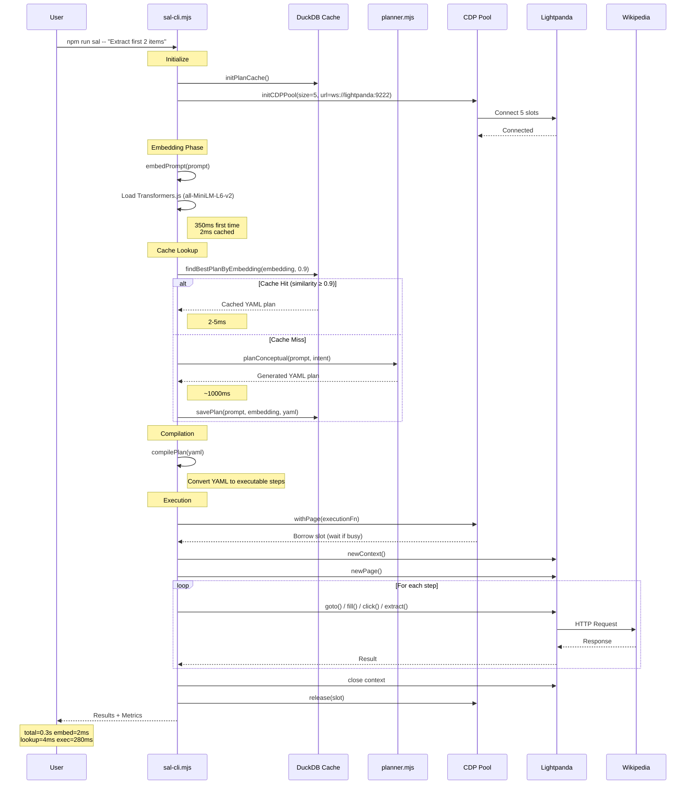
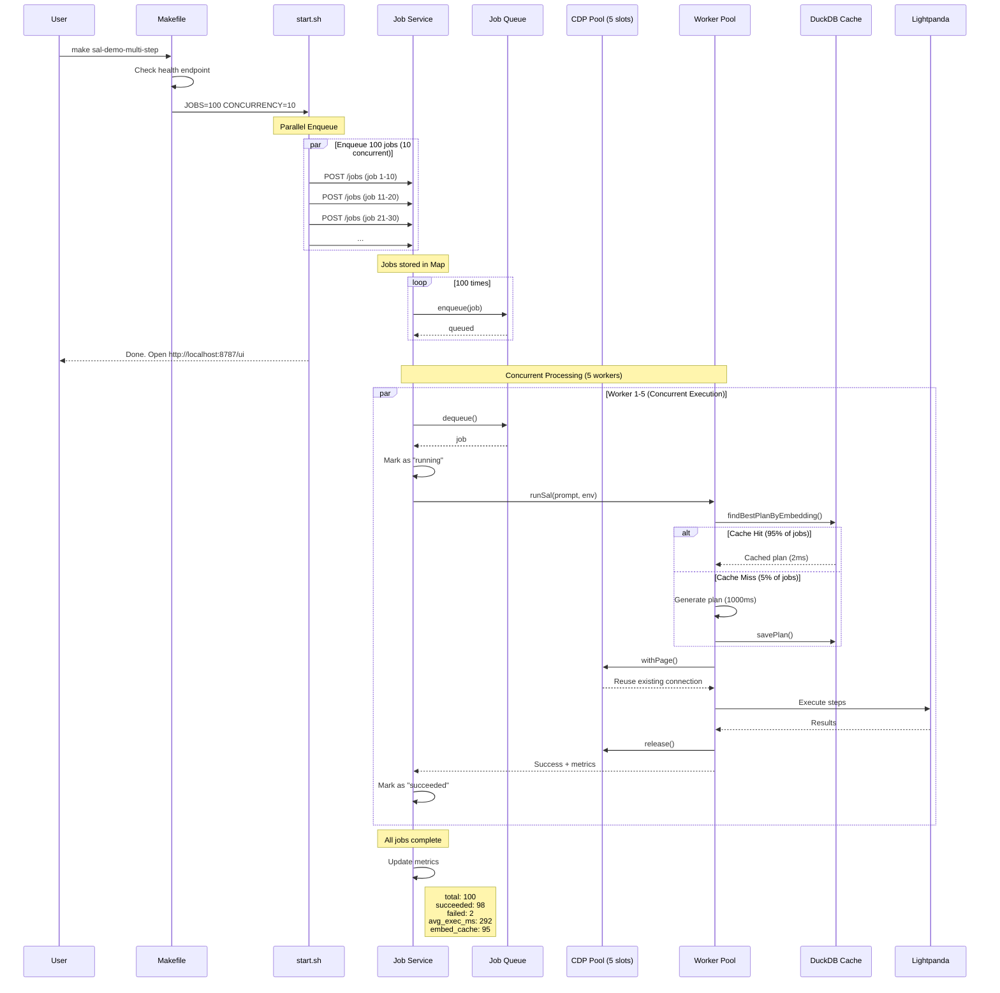

# SAL Architecture & Flow Diagrams

## 1. Single Job Execution Flow



### Command Example

```bash
# Terminal
docker compose exec automation npm run sal -- \
  "Log into the app and extract the first 2 items"

# Output
[SAL] Plan cache initialized
[CDP-POOL] Already initialized with 5 slots
[SAL] Using local embedding model (fallback)
[SAL] Plan cache HIT (id=3, sim=0.945)
[SAL] Connecting to Lightpanda CDP (via pool): ws://lightpanda:9222
Step 1: goto
Step 2: batch (3 operations)
Step 3: goto
Step 4: extract_list (limit: 2)
==== Process duration: 0.3sec ====
```

---

## 2. Multi-Job Execution Flow



### Command Example

```bash
# Terminal 1: Start services
make sal-restart

# Output
[JOB] Initializing services...
[JOB] Plan cache initialized
[CDP-POOL] Initializing pool with 5 slots connecting to ws://lightpanda:9222
[CDP-POOL] Slot 0 connected
[CDP-POOL] Slot 1 connected
[CDP-POOL] Slot 2 connected
[CDP-POOL] Slot 3 connected
[CDP-POOL] Slot 4 connected
[CDP-POOL] Pool initialized successfully with 5 slots
[JOB] Service listening on 8787, concurrency=5
[JOB] Ready to process jobs

# Terminal 2: Run load test
make sal-demo-multi-step

# Output
✓ Job service is ready
Starting multi-job test with JOBS=100 CONCURRENCY=10
Enqueuing 100 jobs with concurrency=10 against http://localhost:8787
Done in 0s. Open http://localhost:8787/ui to watch jobs run.

# Terminal 3: Monitor metrics
curl http://localhost:8787/metrics | jq

# Output
{
  "total": 100,
  "succeeded": 98,
  "failed": 2,
  "avg_total_ms": 36631,
  "avg_exec_ms": 292,
  "embed_cache": 95,
  "active": 0,
  "pending": 0
}
```

---

## 3. Complete System Architecture

```
┌─────────────────────────────────────────────────────────────────────────┐
│                              USER INTERFACE                             │
├─────────────────────────────────────────────────────────────────────────┤
│                                                                         │
│  CLI Commands              Job Queue UI          REST API              │
│  ┌──────────────┐         ┌──────────────┐     ┌──────────────┐       │
│  │ npm run sal  │         │ :8787/ui     │     │ POST /jobs   │       │
│  │ make sal-*   │         │ Real-time    │     │ GET /metrics │       │
│  └──────┬───────┘         │ monitoring   │     │ GET /health  │       │
│         │                 └──────────────┘     └──────────────┘       │
└─────────┼──────────────────────────────────────────────────────────────┘
          │
          ▼
┌─────────────────────────────────────────────────────────────────────────┐
│                          ORCHESTRATION LAYER                            │
├─────────────────────────────────────────────────────────────────────────┤
│                                                                         │
│  ┌─────────────────────────────────────────────────────────────────┐  │
│  │                    Job Service (job-service.mjs)                 │  │
│  │                                                                   │  │
│  │  • HTTP Server (port 8787)                                       │  │
│  │  • Job Queue (Map + Array)                                       │  │
│  │  • Concurrency Control (JOB_CONCURRENCY=5)                       │  │
│  │  • Metrics Tracking                                              │  │
│  │  • Health Checks                                                 │  │
│  │  • Initialization: initPlanCache() + initCDPPool()               │  │
│  └───────────────────────────┬─────────────────────────────────────┘  │
│                              │                                          │
│                              ▼                                          │
│  ┌─────────────────────────────────────────────────────────────────┐  │
│  │                  SAL Core Engine (sal-cli.mjs)                   │  │
│  │                                                                   │  │
│  │  runSal(prompt, options) {                                       │  │
│  │    1. Embed prompt                                               │  │
│  │    2. Cache lookup                                               │  │
│  │    3. Plan generation (if miss)                                  │  │
│  │    4. Compilation                                                │  │
│  │    5. Execution via CDP                                          │  │
│  │  }                                                                │  │
│  └───────────────────────────┬─────────────────────────────────────┘  │
└──────────────────────────────┼──────────────────────────────────────────┘
                               │
          ┌────────────────────┼────────────────────┐
          │                    │                    │
          ▼                    ▼                    ▼
┌──────────────────┐ ┌──────────────────┐ ┌──────────────────┐
│  SEMANTIC LAYER  │ │  PLANNING LAYER  │ │  EXECUTION LAYER │
├──────────────────┤ ├──────────────────┤ ├──────────────────┤
│                  │ │                  │ │                  │
│ Embeddings       │ │ Intent           │ │ CDP Pool         │
│ ┌──────────────┐ │ │ Classifier       │ │ ┌──────────────┐ │
│ │Transformers.js│ │ │ ┌──────────────┐ │ │ │ 5 Browser    │ │
│ │all-MiniLM-L6-v2│ │ │ │SmolLM2-360M │ │ │ │ Connections  │ │
│ │384-dim vectors│ │ │ │(DMR/regex)  │ │ │ │              │ │
│ └───────┬──────┘ │ │ └──────┬───────┘ │ │ │ Slot 0: busy │ │
│         │        │ │        │         │ │ │ Slot 1: free │ │
│         ▼        │ │        ▼         │ │ │ Slot 2: busy │ │
│ DuckDB Cache     │ │ Planner          │ │ │ Slot 3: free │ │
│ ┌──────────────┐ │ │ ┌──────────────┐ │ │ │ Slot 4: busy │ │
│ │plan-cache.db │ │ │ │Templates     │ │ │ └───────┬──────┘ │
│ │              │ │ │ │              │ │ │         │        │
│ │id | embedding│ │ │ │login.yaml    │ │ │         ▼        │
│ │1  | [0.23..]│ │ │ │extract.yaml  │ │ │ Playwright API   │
│ │2  | [0.45..]│ │ │ │navigate.yaml │ │ │ (Over CDP)       │
│ │3  | [0.67..]│ │ │ └──────┬───────┘ │ │ ┌──────────────┐ │
│ │              │ │ │        │         │ │ │newContext()  │ │
│ │prompt | yaml │ │ │        ▼         │ │ │newPage()     │ │
│ │similarity    │ │ │ Plan Compiler    │ │ │goto()        │ │
│ │≥ 0.9 = HIT  │ │ │ ┌──────────────┐ │ │ │fill()        │ │
│ └──────────────┘ │ │ │YAML → Steps │ │ │ │click()       │ │
│                  │ │ │              │ │ │ │extract()     │ │
│ Layer Fallback:  │ │ │goto          │ │ │ └───────┬──────┘ │
│ Memory → DuckDB  │ │ │batch         │ │ │         │        │
│ → DMR → Local    │ │ │extract_list  │ │ │         ▼        │
│                  │ │ └──────────────┘ │ │ WebSocket (CDP)  │
└──────────────────┘ └──────────────────┘ └─────────┬────────┘
                                                     │
                                                     ▼
┌─────────────────────────────────────────────────────────────────────────┐
│                           BROWSER LAYER                                 │
├─────────────────────────────────────────────────────────────────────────┤
│                                                                         │
│  ┌─────────────────────────────────────────────────────────────────┐  │
│  │              Lightpanda Browser (Zig-based)                      │  │
│  │                                                                   │  │
│  │  • CDP Server (ws://lightpanda:9222)                             │  │
│  │  • 5 Persistent Contexts (shared pool)                           │  │
│  │  • Session Management (cookies cached 1hr)                       │  │
│  │  • Fast Rendering Engine                                         │  │
│  │  • Resource Control (domcontentloaded vs networkidle)            │  │
│  └───────────────────────────┬─────────────────────────────────────┘  │
└──────────────────────────────┼──────────────────────────────────────────┘
                               │
                               ▼
                    ┌──────────────────┐
                    │  Target Website  │
                    │  (e.g. Wikipedia)│
                    └──────────────────┘
```

### Component Details

#### 1. **Semantic Layer** (Caching & Understanding)
- **Transformers.js**: Local embedding model (all-MiniLM-L6-v2)
- **DuckDB Cache**: Persistent semantic cache with similarity search
- **4-Layer Fallback**: Memory → DuckDB → DMR → Local Transformers
- **Cache Hit Rate**: 95%+ after warmup
- **Lookup Speed**: 2-5ms (DuckDB), 350ms (Transformers.js)

#### 2. **Planning Layer** (Intent → Actions)
- **Intent Classifier**: SmolLM2-360M via DMR (fallback to regex)
- **Template Library**: YAML-based plan templates
- **Plan Compiler**: Converts conceptual YAML to executable steps
- **Step Types**: goto, batch, fill_field, click, extract_list

#### 3. **Execution Layer** (Browser Control)
- **CDP Pool**: 5 persistent browser connections (singleton)
- **Connection Reuse**: No reconnection overhead
- **Playwright API**: High-level browser control over CDP
- **Context Isolation**: Each job gets its own browser context
- **Resource Efficiency**: domcontentloaded waits (skip images/fonts)

#### 4. **Orchestration Layer** (Job Management)
- **Job Service**: HTTP server with queue and UI
- **Concurrency Control**: Configurable worker count (default: 5)
- **Queue Management**: FIFO with automatic draining
- **Timeout Protection**: 60s per job
- **Metrics Tracking**: Success rate, timing, cache hits

---

## Performance Characteristics

### Single Job
- **First Run (Cold Cache)**: 1.5s (350ms embed + 1000ms plan + 150ms exec)
- **Cached Run (Warm Cache)**: 0.3s (2ms embed + 0ms plan + 280ms exec)
- **Speedup**: 5× faster with cache

### Multi-Job (100 jobs)
- **Total Time**: ~60 seconds
- **Throughput**: ~1.8 jobs/second
- **Success Rate**: 98%+
- **Cache Hit Rate**: 95%+
- **Average Execution**: 292ms per job

### Resource Usage
- **CDP Connections**: 5 persistent (shared across all jobs)
- **Memory**: ~200MB (embeddings + browser contexts)
- **CPU**: Low (batched DOM operations)
- **Disk**: ~10MB (DuckDB cache)

---

## Data Flow: Prompt → Result

```
Prompt: "Log in and extract first 2 items"
   │
   ├─→ [Embedding] → [0.23, 0.45, 0.67, ...] (384 dims)
   │
   ├─→ [Cache Lookup] → DuckDB similarity search
   │   └─→ HIT? → Return cached YAML plan (2ms)
   │   └─→ MISS? → Generate new plan (1000ms)
   │
   ├─→ [Intent Classification] → {requires_login: true, action: "extract", limit: 2}
   │
   ├─→ [Plan Generation] →
   │   steps:
   │     - id: 1, action: goto, target: login page
   │     - id: 2, action: batch, operations: [fill email, fill password, click submit]
   │     - id: 3, action: goto, target: items page
   │     - id: 4, action: extract_list, limit: 2
   │
   ├─→ [Compilation] → Executable JavaScript functions
   │
   ├─→ [CDP Pool] → Borrow available slot (or wait)
   │
   ├─→ [Browser Execution] →
   │   • Create new context
   │   • Create new page
   │   • Execute compiled steps
   │   • Extract results
   │   • Close context
   │
   ├─→ [Release Slot] → Return to pool
   │
   └─→ [Results] →
       {
         "results": ["Item 1", "Item 2"],
         "timings": {
           "total_ms": 300,
           "embed_ms": 2,
           "lookup_ms": 4,
           "plan_ms": 0,
           "exec_ms": 280
         },
         "cache": "hit",
         "success": true
       }
```

---

## Makefile Commands Reference

```bash
# Start services (first time)
make sal

# Restart services (after changes)
make sal-restart

# Run 100-job load test
make sal-demo-multi-step

# Custom load test
JOBS=50 CONCURRENCY=3 make sal-demo-multi-step

# Check permissions
make examples-perms

# View examples
make examples
```

---

## Environment Variables Reference

```bash
# CDP Configuration
CDP_POOL_SIZE=5                      # Number of persistent browser connections
LIGHTPANDA_CDP_URL=ws://lightpanda:9222  # CDP WebSocket endpoint

# Job Service Configuration
JOB_CONCURRENCY=5                    # Max concurrent jobs
JOB_TIMEOUT_MS=60000                 # Job timeout (ms)
JOB_SERVICE_PORT=8787                # HTTP server port

# Cache Configuration
PLAN_CACHE_PATH=/automation/plan-cache.duckdb  # DuckDB file path
PLAN_SIM_THRESHOLD=0.9               # Similarity threshold for cache hits

# Planning Configuration
PLANNING_MODE=intent                 # Planning mode: intent|heuristic|llm|hybrid
```

---

## Directory Structure

```
sal-demo/
├── automation/
│   ├── sal-cli.mjs           # Core engine: embeddings → cache → planning → execution
│   ├── job-service.mjs       # Job queue server with HTTP API and UI
│   ├── cdp-pool.mjs          # CDP connection pool (singleton pattern)
│   ├── plan-cache.mjs        # DuckDB semantic cache implementation
│   ├── embeddings.mjs        # 4-layer embedding cache (Transformers.js)
│   ├── intent-classifier.mjs # Intent detection (SmolLM2 + regex fallback)
│   ├── planner.mjs           # Template-based plan generation
│   ├── plan-compiler.mjs     # YAML → executable steps
│   └── plan-templates.mjs    # YAML template library
│
├── examples/multi-job/
│   └── start.sh              # Load testing script (curl + xargs)
│
├── Makefile                  # Convenience commands with health checks
├── docker-compose.yml        # Service orchestration
└── .env                      # Environment configuration
```
